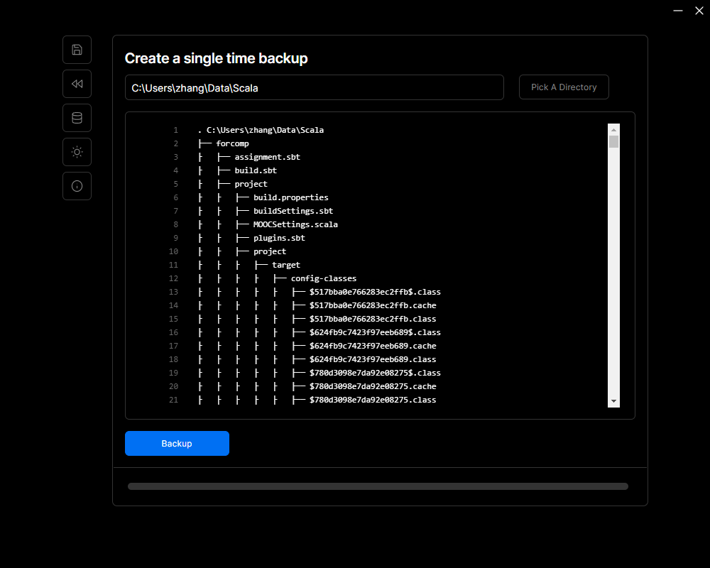
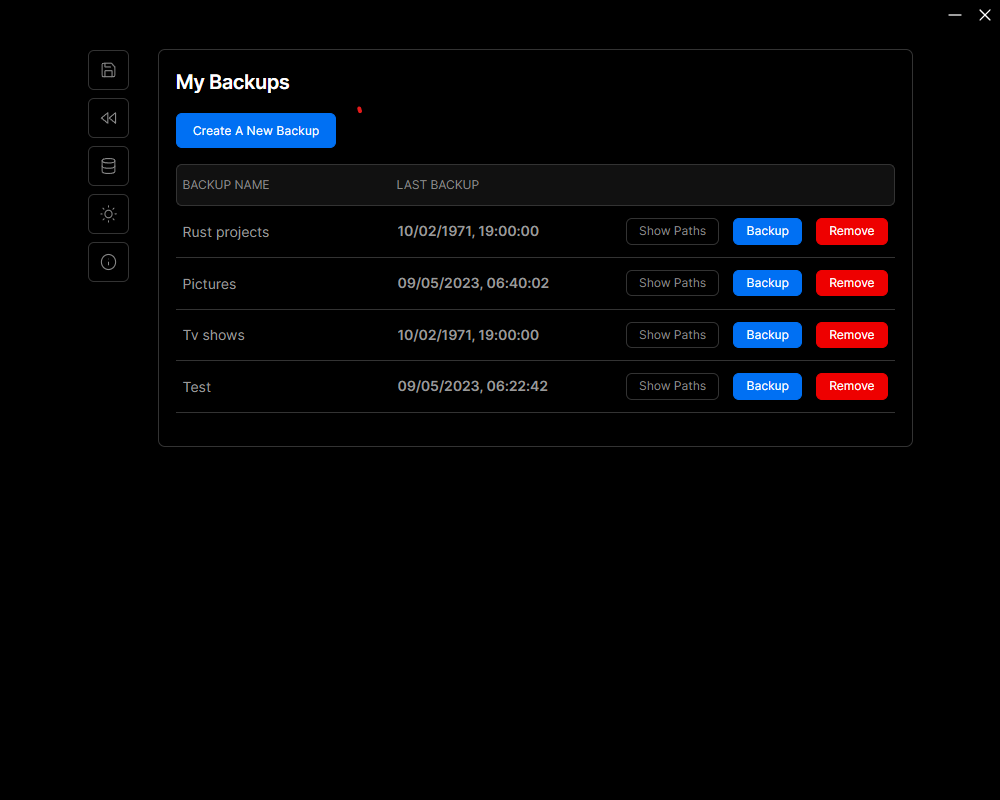

This is a Tauri project using Next.js.

## Starting

```bash
pnpm install
pnpm run dev
```

## Building
```bash
pnpm install
pnpm run build
```

## About
It is using zstd archiving to compress the data. It is a very basic app, not much configuration included. 

## Screenshots


